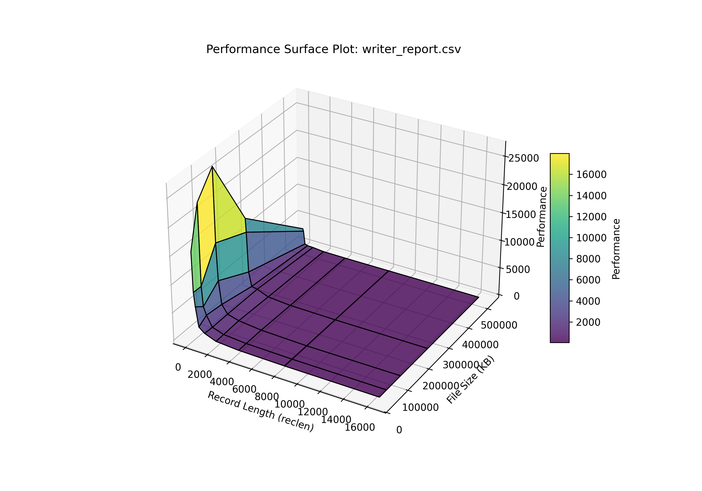
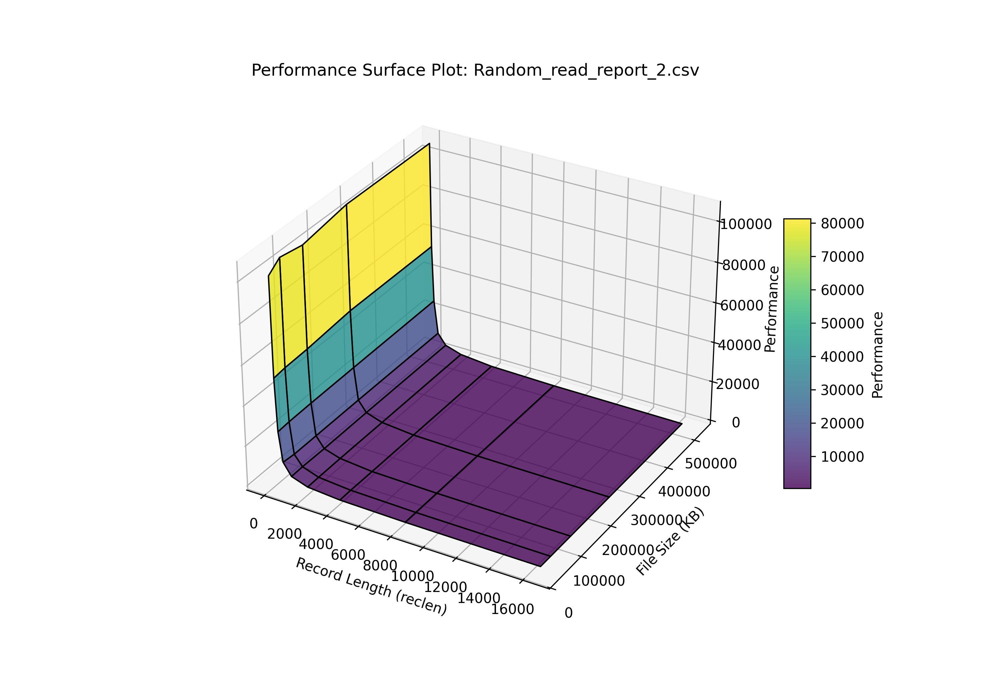
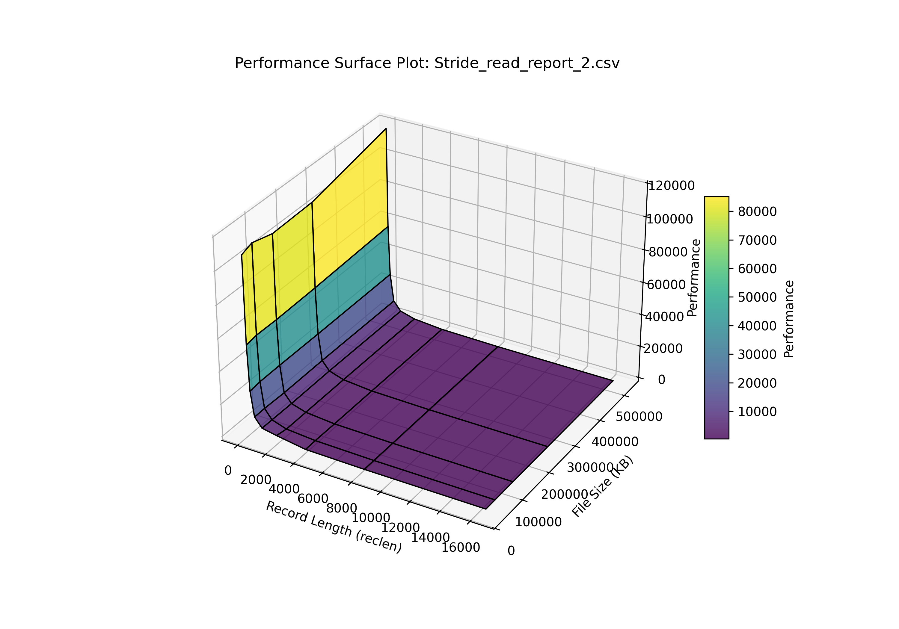
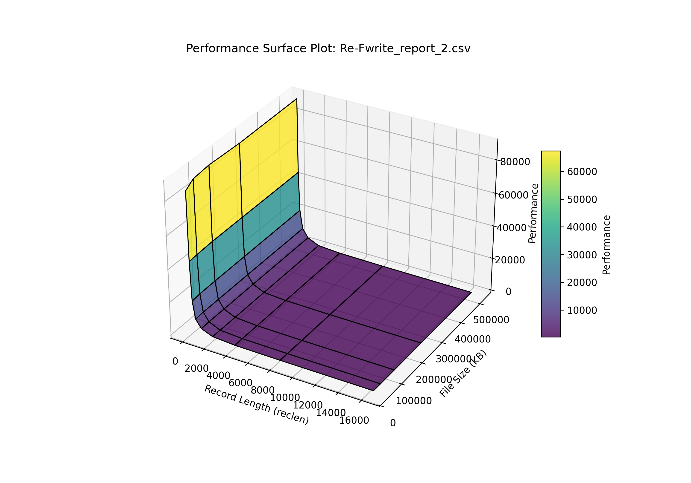

## VBox Cluster

## Goals
In this tutorial, we are going to create a cluster of Linux virtual machines.
- Our machines will be named master  node02, node03,..., node0X.
- The first machine will act as a master node and will have 2vCPUs, 2GB of RAM and 20 GB hard disk. The others will act as workers and will have the same specs
- We will assign our machines static IP address in the internal network: 192.168.0.1, 192.168.0.2, 192.168.0.3, ..., 192.168.0.XX.
The cluster structure can be sketched like this:

![[Excalidraw/cluster.excalidraw]]

Only the master machine is connected to the internet: the others communicate with the master though an internal network, and only through it they are able e.g download packages from the internet.

The specs for the host machine are as follows:
**Hardware**
- CPU: 13th Gen Intel(R) Core(TM) i3-1315U
- RAM: 8 GB
- Hard Disk: MTFDKBA256TFK-1BC1AABHA, 250 GB.
**Software**
- Host Machine: Linux Mint 22.1 Xia
- VM image: Ubuntu Noble 24.04
- Hosted hypervisor: Virtualbox 7.1.6 r167084
## Prerequisite Setup
- VirtualBox must be installed on your system (Windows/Linux/Mac). 
I will be showing installation steps for Linux Mint.
### Virtualbox Installation
1. Update the system
```
sudo apt update && sudo apt upgrade -y
```
2. Install required dependencies
```
sudo apt install -y dkms build-essential linux-headers-$(uname -r)
```
3. Install virtualbox
```
sudo apt install -y virtualbox
```
4. Verify installation
```bash
virtualbox --version
```
### Docker Installation
5. uninstall older version (if any) to ensure a seamless installation
```
sudo apt remove docker docker-engine docker.io containerd runc
```
6. Update system and install required packages
```
sudo apt update
sudo apt install -y apt-transport-https ca-certificates curl software-properties-common
```
7. add Docker's official GPG key
```
curl -fsSL https://download.docker.com/linux/ubuntu/gpg | sudo gpg --dearmor -o /usr/share/keyrings/docker-archive-keyring.gpg
```
8. add the Docker repository
```
echo "deb [arch=$(dpkg --print-architecture) signed-by=/usr/share/keyrings/docker-archive-keyring.gpg] https://download.docker.com/linux/ubuntu $(lsb_release -cs) stable" | sudo tee /etc/apt/sources.list.d/docker.list > /dev/null
```
9. Install Docker
```
sudo apt update
sudo apt install -y docker-ce docker-ce-cli containerd.io
```
10. Enable and start Docker service
```bash
sudo systemctl enable docker
sudo systemctl start docker
```
11. Check Docker status
```
sudo systemctl status docker
```

## Template VM Creation
**Objective**: Create a template VM that can be cloned to deploy the cluster.
### Creation
- Download the Ubuntu 24.0.4 image from Ubuntu's website (https://ubuntu.com/download/server).
- In VirtualBox click _**Machine>New**_.
- Configure name and operating system of the machine (you must select the Ubuntu image previously downloaded).
	- In our case, these will be `template` and `ubuntu-24.04.1-live-server-amd64.iso`
- Configure username and password.
	- e.g *user01* and *changeme*.
- Configure hardware (lets select 2048 MB of RAM memory and 2 CPU).
- Configure hard disk. I left the default values (20 GB)
After clicking _Finish_, the machine will start.

### Package installation

Update apt package manager:
```
sudo apt update
sudo apt upgrade
```

Then, install some additional packages running
```
sudo apt install net-tools gcc make openssh-server
```

After setting up the template VM, shut it down:
```
sudo shutdown -h now
```

The template machine is now ready for cloning.

## Master/Nodes creation & Network adapters configuration
### Cloning
Lets clone the template machine in order to start setting up our cluster.
- Right click on _template_ machine in VirtualBox and then select _Clone_.
- Set a name for you clone
	- e.g master, as this first clone will be our master node.
- Repeat any number of times to create the worker nodes
	- in this example, only two nodes, node02 and node04 are created.
### Network adapters configuration
Once it is created, let's configure the two network adapters:
12. Adapter 1 (NAT): This connects the VM to the host’s network and allows internet access.
13. Adapter 2 (Internal network): This is used for communication between the VMs on a private internal network, where each VM is assigned a static IP address.
The right configuration depends on the role of the node in the cluster:
- **master**: right click in the virtual machine  and then **_Settings>Network_**. Check that the first adapter is attached to NAT. Then, on adapter 2 on _Enable Network Adapter_ and attach it to _Internal Network_, then click Then select a name for the network that must be the same for all the nodes (e.g., _clustervimnet_).
- **workers**: only enable the second adapter for the internal; network. If applicable, repeat the configuration for other nodes.

##  Setting Up Port Forwarding for SSH

### Port forwarding rule
To connect to the VMs (e.g., the master node) from your host machine, VirtualBox requires port forwarding rules to map ports from the guest VMs to your host machine. In this case, you’ll set up a rule to forward SSH traffic from port 2222 on the host to port 22 on the master node.

- Open VirtualBox and right-click on the _master_ machine, then **_Settings>Network>Port Forwarding>Add_**.
- Fill the gaps the table as follows.

| Namer  | Protocol | Host IP | Host Port | Guest IP | Gest Port |
| ------------- | ------------- | ------------- | ------------- | ------------- | ------------- |
| ssh  | TCP  | 127.0.0.1 | 2222 | | 22 |

- Apply the changes and restart the VM.

Lets check it is enabled now by running the command:
```
sudo systemctl status ssh
```

To ensure it starts on boot:
```
sudo systemctl enable ssh
```


### Passwordless SSH
To avoid entering a password each time you connect via SSH, you can configure SSH key-based authentication.

First, on your host machine, generate an SSH key pair (if you don’t have one). 
```
ssh-keygen
```

Now, copy the generated public key (mine is _id_ed25519.pub_ but yours can be different) from your host to the master node (your VM must be running).
```
cd .ssh
scp -P 2222 id_ed25519.pub user01@127.0.0.1:~
```

If your host machine shows a HUGE warning telling you that you can be suffering a man-in-the-middle attack, don't worry, you are that man. 
When you connect to an SSH server for the first time, the server’s host key is stored in the known_hosts file on your client machine. 
If the host key of the server changes (which can happen, for example, if you rebuild the VM), SSH assumes this could be a security issue. 
You need to remove the outdated or incorrect host key from your known_hosts file and run the _scp_ command again.
```
ssh-keygen -R [127.0.0.1]:2222
```

At this point, you should have been able to connect you VM by SSH. Now that the public key has been copied into your home directory, lets add it to the `authorized_keys` file.
```
cat id_ed25519.pub >> .ssh/authorized_keys
rm id_ed25519.pub
```

To verify everything works fine, just open a new terminal in your host machine and launch an SSH connection.
If everything is set up correctly, you will be logged in without needing to enter a password.
It's now possible to access the master node the following way:
```bash
ssh -p 2222 user01@127.0.0.1
```

## Network Configuration for Master Node
The master node will act as the control point for the cluster, managing DNS (domain name system) and DHCP (dynamic host configuration protocol) services.

### Configure the network file
You need to configure the second network adapter (Adapter 2) to assign a static IP address. This IP address will allow the master node to communicate with the other worker nodes on the internal network.

After starting and logging into the master VM, find the network interfaces available on your VM using
```
ip link show
```

The output will be something similar to this:
```bash
1: lo: <LOOPBACK,UP,LOWER_UP> mtu 65536 qdisc noqueue state UNKNOWN mode DEFAULT group default qlen 1000
    link/loopback 00:00:00:00:00:00 brd 00:00:00:00:00:00
2: enp0s3: <BROADCAST,MULTICAST,UP,LOWER_UP> mtu 1500 qdisc fq_codel state UP mode DEFAULT group default qlen 1000
    link/ether 08:00:27:cc:e4:69 brd ff:ff:ff:ff:ff:ff
3: enp0s8: <BROADCAST,MULTICAST,UP,LOWER_UP> mtu 1500 qdisc fq_codel state UP mode DEFAULT group default qlen 1000
    link/ether 08:00:27:be:2e:41 brd ff:ff:ff:ff:ff:ff
```

where
- **enp0s3** is the first adapter (NAT).
- **enp0s8** is the second adapter (internal network).

We want to configure `enp0s8` to have a static IP, like 192.168.0.1. 

To do this, let's edit the Netplan configuration file.
- Open the file with:
```
sudo vim /etc/netplan/50-cloud-init.yaml
```
- Add the necessary lines to make it look like this:
```yaml
network:
  version: 2
  ethernets:
    enp0s3:
      dhcp4: true
    enp0s8:
     dhcp4: false
     addresses: [192.168.0.1/24]
```

Finally, apply the changes with
```
sudo netplan apply
```

### Configure hosts
To make it easier to identify machines in the cluster, let's change the hostname of the master node. Open the host file with:
```
sudo vim /etc/hostname
```
and change its content to _master_.

We also need to define the static IP address and hostname for the master node in `/etc/hosts` file. Open the file with:
```
sudo vim /etc/hosts
```
and edit it until looks like this:
```yaml
127.0.0.1 localhost
192.168.0.1 master

192.168.0.2 node02
192.168.0.4 node04

# The following lines are desirable for IPv6 capable hosts
...

```

Now you should be able to perform passwordless ssh into the other nodes as well. Type "yes" when prompted if you want to trust the host's authenticity.
```bash
ssh user01@192.168.0.2
ssh user01@192.168.0.4
```
Verify that this is the case, as it is crucial for upcoming tests to work and actually be able to distribute workload across the cluster.

### Port Forwarding and NAT in the Internal Network
In order to connect to the internet from the worker nodes using the master node as a gateway, we need to configure port forwarding in our master node.

Let's create a new file and write the following line:
```
sudo vim /etc/sysctl.d/99-ipforward.conf
```


```bash
net.ipv4.ip_forward=1
```

Apply changes:

```bash
sudo sysctl --system
```

Verify that IP forwarding is enabled by running the following command. If the ouput is "1", everything is fine by now.

```bash
cat /proc/sys/net/ipv4/ip_forward
```

We need now to ensure that *IP tables* are configured to allow NAT (Network Address Translation) between network interfaces.

Iptables-persistent is a package that automatically saves your current iptables rules and loads them when the system boots. 
Let's install it (press yes all the times it is needed):

```bash
sudo apt install iptables-persistent
```

Now it's time to set up a NAT rule for the outgoing interface (enp0s3) and save it:

```bash
sudo iptables -t nat -A POSTROUTING -o enp0s3 -j MASQUERADE
sudo netfilter-persistent save
```

## Distributed File System
To build a cluster, you need a shared filesystem that all nodes can access.

Lets begin installing the NFS kernel server package.
```
sudo apt install nfs-kernel-server
```

Then create a shared directory that all nodes will access.
```
sudo mkdir /shared
sudo chmod 777 /shared
```

Open the NFS exports file and specify the directory and network permissions.
- **rw**: Grants read and write permissions.
- **sync**: Ensures changes are written to disk immediately.
- **no_root_squash**: Allows root users on clients to access files as root.
- **no_subtree_check**: Disables subtree checking for better performance.
```
sudo vim /etc/exports
```

```yaml
/shared/ 192.168.0.0/255.255.255.0(rw,sync,no_root_squash,no_subtree_check)
```
This allows all machines on the internal network (192.168.0.0/24) to access the shared directory with read/write permissions.

Enable and start the NFS server.
```
sudo systemctl enable nfs-kernel-server
sudo systemctl restart nfs-kernel-server
```

We can now create a test file in the new folder
```
touch /shared/ciao_mondo.txt
```

## Worker Nodes Configuration

### Configure hosts

Let's change the hostnames of the worker nodes. Open the host file with:
```
sudo vim /etc/hostname
```
and change its content to node02.

### Network configuration
First, modify the network file. Remove the NAT adapter: it is not needed, as traffic outside the cluster will go through the master node and redirected back to us.  
```
sudo vim /etc/netplan/50-cloud-init.yaml
```

```yaml
network:
  version: 2
  ethernets:
    enp0s8:
      dhcp4: no
      addresses:
        - 192.168.0.2/24
      routes:
        - to: 0.0.0.0/0
          via: 192.168.0.1 
      nameservers:
        addresses:
          - 8.8.8.8
          - 8.8.4.4
```

Apply the configuration:
```
sudo netplan apply
```

Finally, set the DNS server.
```
sudo ln -fs /run/systemd/resolve/resolv.conf /etc/resolv.conf
```
Now it is time to reboot our VM. 

After rebooting, in order to verify that the network works, run:
```
hostname -I
```

There you should be able to see the IP address assigned to the interface enp0s8.
On the master node:
```
10.0.2.15 192.168.0.1 fd00::a00:27ff:fecc:e469 
```
On the worker nodes:
```
192.168.0.2 #or whatever other numbers in the range given in the netplan
```

Moreover, you should also be able to ping between your nodes 
```
ping 192.168.0.1
```
and to the internet. In this case, for worker nodes, the traffic is still handled by the master node, but the NAT tables are able to distribute it back. 
```
ping 8.8.8.8
```

If it works, that means that your master node is able to return the packages from the destination to you.

### File System configuration (mounting point)
Lets install the NFS client on each worker node.
```
sudo apt install nfs-common
```

Create a mount point (where the shared folder from the master will be mounted).
```
sudo mkdir /shared
```

Mount the shared directory from the master node to this folder.
```
sudo mount 192.168.0.1:/shared /shared
```

To check if everything went fine, just show the content of the folder. The file `ciao_mondo.txt` should appear.
```
ls /shared
```

NOTE: This type of mounting only works while the machine is running. After rebooting the mount point will disappear.


### File System configuration (automatic mount)
Install AutoFS to automatically mount the shared directory on boot, install the AutoFS package.
```
sudo apt -y install autofs
```

Edit the `auto.master` configuration file to include the mount points adding the following line:
```
sudo vim /etc/auto.master
```
```
/- /etc/auto.mount
```

Create the AutoFS configuration file (`auto.mount`) to define the NFS mount. Add the following configuration:
```
sudo vim /etc/auto.mount
```
```yaml
/shared -fstype=nfs,rw  192.168.0.1:/shared
```

Finally, restart AutoFS service to apply changes.
```
sudo systemctl restart autofs
```
Now the `shared` folder shoud remain mounted even after rebooting your node.

### More workers

In order to create more worker nodes, we only need to clone our already configured node.
After bootstrapping we should change the hostname to the new node name by running:
```
sudo vim /etc/hostname
```

```bash
node<n>
```
Don't forget to change the `hosts` file as well in each node, adding the new one:
```bash
sudo vim /etc/hosts
```

```bash
...
192.168.0.<n> node<n>
...
```

Once the machine is rebooted, it will be able to connect to the internet or other nodes and access the shared file system.

## Installing the packages
Before testing, we need to install some necessary packages. While some can simply be fetched, other require a non-trivial setup
### HPCC
The HPCC benchmark is a series of tests that measure the performance of a computer cluster with a host of different operations. Below is a quick summary of each:
- **HPL (High-Performance Linpack) Gflops**
    - Measures the floating-point performance for solving a dense system of linear equations.
    - Often used to rank supercomputers (e.g., TOP500 list).
- **DGEMM (Double Precision General Matrix-Matrix Multiplication) Gflops**
    - Evaluates the raw floating-point computational performance of matrix-matrix multiplication.
    - Used to estimate the peak performance of a system.
- **PTRANS (Parallel Matrix Transpose) GB/s**
    - Tests memory bandwidth and communication performance by transposing a large distributed matrix.
    - Important for large-scale distributed-memory systems.
- **MPI RandomAccess GUPs (Giga Updates per Second)**
    - Measures the speed of performing updates in a large distributed array.
    - Highlights memory access latency and network performance.
- **Star RandomAccess GUPs**
    - Similar to MPI RandomAccess but executed differently, providing a comparison point for distributed vs. single-node performance.
- **Single RandomAccess GUPs**
    - Tests random memory access performance within a single node.
    - Reflects cache and memory architecture efficiency.
- **MPI FFT (Fast Fourier Transform) Gflops**
    - Evaluates the performance of distributed Fast Fourier Transform calculations.
    - Used for signal processing and scientific computing workloads.
- **Star FFT Gflops**
    - Measures FFT performance with a slightly different implementation, providing an alternative metric.
- **Single FFT Gflops**
    - Tests the FFT performance on a single node.
- **Star STREAM Copy GB/s**
    - Measures memory bandwidth by testing the speed of copying large arrays in parallel.
- **Single STREAM Copy GB/s**
    - Measures memory bandwidth on a single node.
- **Star STREAM Triad GB/s**
    - Evaluates memory bandwidth and computational performance by performing a specific vector operation (`a = b + scalar * c`).
- **Single STREAM Triad GB/s**
    - The same as Star STREAM Triad, but limited to a single node.


The installationprocedure for the HPCC module is convoluted to say the least. 
It is dependent on the Intel MKL library, which needs then to be installed first on all nodes.
Add Intel's GPG key
```bash
wget -qO - https://apt.repos.intel.com/intel-gpg-keys/GPG-PUB-KEY-INTEL-SW-PRODUCTS.PUB | sudo tee /etc/apt/trusted.gpg.d/intel.gpg > /dev/null
```
Install the MKL (Math Kernel Library) with all its dependencies
```bash
sudo apt install intel-mkl intel-oneapi-mkl intel-oneapi-mkl-devel
```
Now, load Intel OneAPI environment variables
```bash
source /opt/intel/oneapi/setvars.sh
```
Now, finally, install OpenAPI
```bash
sudo apt install openmpi-bin openmpi-common libopenmpi-dev
```
Having done this, we are ready to clone the HPCC repository and compile it.
```bash
cd /shared/
git clone https://github.com/icl-utk-edu/hpcc.git
cd hpcc/
```
In the `hpl/setup` folder, one can find the available system builds for HPCC. 
Check your machine's architecture with
```bash
inxi -Fxz
```
Having a 64-bit Linux Virtual Machine running on top of an Invidia CPU, and using MKL libraries, the closest match was  `LinuxIntelIA64Itan2 eccMKL`.

Compile `hpcc` with the appropriate `Makefile` by specifying the `arch`
```bash
make arch=LinuxIntelIA64Itan2 eccMKL
```
Depending on the machine and the environment, various errors could appear.
Thanks to [Carlos](https://github.com/carlos-vf/Cluster-Creation-and-Testing-with-VirtualBox-VMs-and-Docker-Containers/blob/main/Cluster%20Creation%20and%20Performance%20Testing%20in%20VirtualBox.md) for discovering these and contributing with a solution. 
Modify the Makefile for the corresponding variables
```Makefile
LAlib = -L${MKLROOT}/lib/intel64 -lmkl_intel_lp64 -lmkl_intel_thread -lmkl_core -liomp5 -lpthread -lm -ldl
...
CCFLAGS      = $(HPL_DEFS) -O3 -fno-strict-aliasing -Wall -mtune=native
```
Now it should be able to link the right libraries. 

Once all the issues are solved, you should read:
```
make[1]: Entering directory:`/shared/hpcc/hpl/lib/arch/build`
make[1]: '.../.../.../.../hpcc' is up to date.
make[1]: Leaving directory:`/shared/hpcc/hpl/lib/arch/build`
```
Let's test it works by running
```bash
hpcc
```
and, after it's done, checking the hpccout.txt file, where the outcome of all the tests is written. The file should end with
```bash
########################################################################
End of HPC Challenge tests.
Current time (1739010864) is <your local time and date>

########################################################################
```
meaning all tests were done successfully.

### Other modules
Other modules can be installed simply via package managers.
```bash
sudo apt install iozone3 iperf3 sysbench stress-ng
```

## Performance testing

It is desirable to partially automate testing in order to seamlessly compare the results between VMs and Containers. Within the /shared folder, a subfolder `results` is created, which will store all test results separately.
```bash
mkdir -p /shared/results
chmod 777 /shared/results
```
various test scripts were created. 

**run_hpcc.sh**
- executes the hpcc performance benchmark
```bash
#!/bin/bash

RESULT_FILE="/shared/results/hpcc_results.txt"
chmod 777 /shared/results/*.txt
echo "🔥 Distributed CPU Performance Test (HPCC) Results" > $RESULT_FILE
echo "-------------------------------------------------" >> $RESULT_FILE

# Run HPCC Benchmark with MPI
echo "⚙️ Running MPI HPCC Benchmark..."
mpirun --host 192.168.0.2:2,192.168.0.4:2 -np 2 hpcc | tee -a $RESULT_FILE

echo "✅ HPCC Benchmark completed! Results saved in $RESULT_FILE"

```

**sysbench_tests.sh**
- Conducts a distributed CPU performance test across multiple nodes.
- Uses `sysbench` to stress the CPU with prime number calculations.    
- Executes via `mpirun`, running the test on specified nodes (`192.168.0.1`, `192.168.0.2`, `192.168.0.4`).
```bash 
#!/bin/bash

RESULT_FILE="/shared/results/sysbench_test_results.txt"
chmod 777 /shared/results/*.txt
echo "🔥 Distributed CPU Performance Test Results" > $RESULT_FILE
echo "------------------------------------------" >> $RESULT_FILE

# Run sysbench across all nodes using MPI
echo "⚙️ Running MPI Sysbench CPU test across all nodes..."
mpirun --host 192.168.0.2:2,192.168.0.4:2 -np 2 sysbench cpu run --cpu-max-prime=20000 --threads=2 2>&1 | tee -a $RESULT_FILE

echo "⚙️ Running MPI Sysbench memory test across all nodes..."
mpirun --host 192.168.0.2,192.168.0.4 -np 2 sysbench memory run 2>&1 | tee -a $RESULT_FILE

echo "✅ Distributed CPU test completed! Results saved in $RESULT_FILE"

```

**stressng_tests.sh**
- **Purpose**: Performs system-wide stress tests, including memory, cpu disk operations.
- Uses `stress-ng` to apply load on memory (`--vm`), disk (`--hdd`) and cpu (`--cpu`).
- Runs across multiple nodes with `mpirun`.
- Creates and uses a shared temporary directory `/shared/tmp`.
```bash 
#!/bin/bash

# ✅ Define result file
RESULT_FILE="/shared/results/stressng_test_results.txt"
chmod 777 /shared/results/*.txt
echo "🔧 Distributed System Performance Test Results" > $RESULT_FILE
echo "--------------------------------------------" >> $RESULT_FILE

# ✅ Ensure a writable temporary directory
TMP_DIR="/shared/tmp"
mkdir -p $TMP_DIR
chmod 777 $TMP_DIR

HOSTLIST="192.168.0.2:2,192.168.0.4:2"

echo "⚡ Running CPU test..."
mpirun --host $HOSTLIST -np 2 env TMPDIR=$TMP_DIR stress-ng --cpu 2 --timeout 60s --metrics-brief --temp-path $TMP_DIR 2>&1 | tee =a $RESULT_FILE

echo "⚡ Running distributed memory test..."
mpirun --host $HOSTLIST -np 2 env TMPDIR=$TMP_DIR stress-ng --vm 2 --vm-bytes 512M --timeout 60s --metrics-brief --temp-path $TMP_DIR 2>&1 | tee -a $RESULT_FILE

echo "⚡ Running disk test..."
mpirun --host $HOSTLIST -np 2 env TMPDIR=$TMP_DIR stress-ng  --hdd 2 --hdd-write-size 10 --timeout 60s --metrics-brief --temp-path $TMP_DIR 2>&1 | tee -a $RESULT_FILE

echo "✅ Distributed System test completed! Results saved in $RESULT_FILE"

```
**disk_io_test.sh**
- **Purpose**: Evaluates disk I/O performance using `iozone`.
- Executes read/write tests on all nodes using `mpirun`.
```bash 
#!/bin/bash

RESULT_FILE="/shared/results/disk_io_test_results.txt"
chmod 777 /shared/results/*.txt
echo "💾 Distributed Disk I/O Performance Test Results" > $RESULT_FILE
echo "------------------------------------------------" >> $RESULT_FILE
MIN_SIZE=32768
MIN_RECLEN=64

# Run IOZone in parallel across all nodes
echo "📂 Running IOZone Test across all nodes..."
mpirun --host 192.168.0.1,192.168.0.2,192.168.0.4 -np 2 iozone -n $MIN_SIZE -y $MIN_RECLEN -a -R -O | awk '/Excel output is below:/ {found=1; print; next} found' > excel_output.xls

echo "📂 Running IOZone Test on the /shared folder (small file size)" >> $RESULT_FILE
touch iozone_testfile2.txt
mpirun --host 192.168.0.1,192.168.0.2,192.168.0.4 -np 2 iozone -s 56M -r 1k -n $MIN_SIZE -y $MIN_RECLEN iozone_testfile2.txt -R -O | awk '/Excel output is below:/ {found=1; print; next} found'> excel_output2.xls

echo "✅ Distributed Disk I/O test completed! Results saved in $RESULT_FILE"

```
The output is large: it's a table with various columns.
- **kB** – The total file size used in the test, measured in kilobytes.
- **reclen** – The record length, indicating the size of each block used for reading or writing.
- **write** – The speed of sequential writing, measured in kilobytes per second (KB/s).
- **rewrite** – The speed of rewriting existing data in the file.
- **read** – The speed of sequential reading.
- **reread** – The speed of reading the file again to check caching effects.
- **bkwd read** – The speed of reading the file backward.
- **record rewrite** – The speed of rewriting small parts of a file.
- **stride read** – The speed of reading the file with a stride (skipping blocks).
- **fwrite** – The speed of writing with `fwrite()` (buffered write).
- **frewrite** – The speed of rewriting with `fwrite()`.
- **fread** – The speed of reading with `fread()`.
- **freread** – The speed of re-reading with `fread()`.

The rows are varying combinations of file sizes and record lengths. For example, having a file of size e.g 128 kb, we track the speed of all operations performed with in in blocks of 4 kb, then 8, 16 ... and so on until the block size is equal to the file size. 
We limit the output to a specific range in order to have complete data  (otherwise after a certain threshold, smaller record sizes would be skipped when the file was too large):
- minimum record length (option `-y`): 64 kb
- minimum file size (option `-g`): 32728
Then, the file size is increased, until 524288 kb by default. 

**network_test.sh**: 
- Measures network performance using `iperf3`.
- Starts an `iperf3` server on `192.168.0.1`.
- Runs upload/download speed tests from clients (`192.168.0.2`, `192.168.0.4`).
- Ensures `iperf3` is installed on all nodes before running tests.
NOTE: before running this test, ensure no other process is using `iperf3` by killing all processes related to it. 
```bash
sudo killall iperf3
```

```bash 
#!/bin/bash

# Define server and clients
SERVER="192.168.0.1"
CLIENTS=("192.168.0.2" "192.168.0.4")
DURATION=30  # Test duration in seconds
PARALLEL_STREAMS=2  # Number of parallel streams

# Ensure iperf3 is installed on all nodes
for NODE in "${SERVER}" "${CLIENTS[@]}"; do
    ssh $NODE "command -v iperf3 >/dev/null 2>&1 || (sudo apt update && sudo apt install -y iperf3)"
done

# File to save results
RESULT_FILE="/shared/results/network_test_results.txt"
chmod 777 /shared/results/*.txt
echo "📡 Network Performance Test Results" > $RESULT_FILE
echo "---------------------------------" >> $RESULT_FILE

# Start iperf3 server on 192.168.0.1
echo "🚀 Starting iperf3 server on 192.168.0.1..."
iperf3 -s &

# Function to run iperf3 test
run_iperf_test() {
    CLIENT=$1
    MODE=$2  # "upload" or "download"
    OUTPUT_FILE="/shared/results/iperf_${CLIENT}_${MODE}.txt"

    if [ "$MODE" == "upload" ]; then
        echo "🚀 Testing UPLOAD from $CLIENT to $SERVER..."
        ssh $CLIENT "iperf3 -c $SERVER -t $DURATION -P $PARALLEL_STREAMS" > $OUTPUT_FILE
    else
        echo "📥 Testing DOWNLOAD from $SERVER to $CLIENT..."
        ssh $CLIENT "iperf3 -c $SERVER -t $DURATION -P $PARALLEL_STREAMS -R" > $OUTPUT_FILE
    fi

    # Extract relevant data and save to result file
    THROUGHPUT=$(grep "sender" $OUTPUT_FILE | awk '{print $7, $8}')
    echo "$CLIENT $MODE Speed: $THROUGHPUT" | tee -a $RESULT_FILE
}

# Run tests for each client
for CLIENT in "${CLIENTS[@]}"; do
    run_iperf_test $CLIENT "upload"
    run_iperf_test $CLIENT "download"
done

echo "✅ All network tests completed! Results saved in $RESULT_FILE"
```
Run all of the tests one after another. Results are automatically stored in the aforementioned directory.
```bash
bash ~/tests/cpu_test.sh
bash ~/tests/system_test.sh
bash ~/tests/disk_io_test.sh
bash ~/tests/network_test.sh
```
# Docker containers

We now aim at reproducing the same setup built for VMs with containers, and compare the performance between the two. 

The setup is much more immediate here: we can provide all the necessary information to build our system in 2 files and then Docker will build it automatically:
- `Dockerfile`: setup the Ubuntu server image with all the necessary packages and folders; here we directly download all necessary packages for testing and setup passwordless ssh. We set up a standard user, beside `root` (docker default) to run tests.
```Dockerfile
FROM ubuntu:latest

# Set non-interactive mode for apt-get
ENV DEBIAN_FRONTEND=noninteractive

# Install required packages
RUN apt-get update && apt-get install -y \
    openssh-server rsync iputils-ping \
    sysbench stress-ng iozone3 iperf3 \
    netcat-openbsd wget unzip hpcc \
    openmpi-bin openmpi-common openmpi-doc libopenmpi-dev \
    sudo \
    && rm -rf /var/lib/apt/lists/*

# ✅ Create SSH folder and set correct permissions
RUN mkdir -p /var/run/sshd /home/user/.ssh /shared/results \
    && chmod 700 /home/user/.ssh

# ✅ Create a new user 'user' with a home directory
RUN useradd -m -s /bin/bash user \
    && echo "user:userpassword" | chpasswd \
    && echo "user ALL=(ALL) NOPASSWD:ALL" >> /etc/sudoers

# ✅ Ensure SSH is configured for user
RUN sed -i 's/#PermitRootLogin prohibit-password/PermitRootLogin no/' /etc/ssh/sshd_config \
    && sed -i 's/UsePAM yes/UsePAM no/' /etc/ssh/sshd_config \
    && sed -i 's/#PubkeyAuthentication yes/PubkeyAuthentication yes/' /etc/ssh/sshd_config \
    && sed -i 's|#AuthorizedKeysFile.*|AuthorizedKeysFile .ssh/authorized_keys|' /etc/ssh/sshd_config

# ✅ Copy SSH keys for user (passwordless login)
COPY ssh_keys/id_rsa.pub /home/user/.ssh/authorized_keys
COPY ssh_keys/id_rsa /home/user/.ssh/id_rsa

# ✅ Set correct permissions for SSH keys (user)
RUN chmod 600 /home/user/.ssh/id_rsa /home/user/.ssh/authorized_keys \
    && chown -R user:user /home/user/.ssh

# ✅ Expose SSH port
EXPOSE 22

# ✅ Allow MPI to run without root restrictions
ENV OMPI_ALLOW_RUN_AS_ROOT=1
ENV OMPI_ALLOW_RUN_AS_ROOT_CONFIRM=1

# ✅ Switch to user
USER user
WORKDIR /home/user

# ✅ Start SSH service correctly with host key generation
CMD sudo ssh-keygen -A && sudo /usr/sbin/sshd -D -e && sudo chown -R user:user /shared/results && sudo chmod -R 777 /shared/results
```
- `docker-compose.yaml`: initializes 3 different ubuntu servers with ports, shared volumes and desired specs; we include the test folder as well, which will be run in the cluster as a whole.
```yaml
version: "3.8"

services:
  master:
    build: .
    container_name: master
    networks:
      - my_network
    deploy:
      resources:
        limits:
          cpus: "2"
          memory: 2G
    ports:
      - "2220:22"
    volumes:
      - shared_volume:/shared
      - ./ssh_keys:/root/.ssh # Mount pre-generated SSH keys for passwordless access
      - ./tests:/home/tests
    tmpfs:
      - /shared/results:mode=777

  worker1:
    build: .
    container_name: worker1
    networks:
      - my_network
    deploy:
      resources:
        limits:
          cpus: "2"
          memory: 2G
    ports:
      - "2221:22"
    volumes:
      - shared_volume:/shared
      - ./ssh_keys:/root/.ssh
      - ./tests:/home/tests
    tmpfs:
      - /shared/results:mode=777
  worker2:
    build: .
    container_name: worker2
    networks:
      - my_network
    deploy:
      resources:
        limits:
          cpus: "2"
          memory: 2G
    ports:
      - "2222:22"
    volumes:
      - shared_volume:/shared
      - ./ssh_keys:/root/.ssh
      - ./tests:/home/tests
    tmpfs:
      - /shared/results:mode=777

networks:
  my_network:
    driver: bridge

volumes:
  shared_volume:
    driver: local

```

NOTE: the tests in the `tests/` are adapted to the container environment. Working with virtual machines we had statically assigned IPs, while now we have dynamically assigned ones. We substitute them with the container names for simplicity, although IDs could also be used.
- 192.168.0.1 becomes `master`
- 192.168.0.2 becomes `worker1`
- 192.168.0.4 becomes `worker2`

This way, with minimal changes, we are able to reuse the tests with containers as well.
Proceed by building the containers
```bash
sudo docker compose up --build --d
```
Check that they are actually running
```bash
sudo docker ps
```
If no containers show up, something went wrong: check with this command.
```bash
sudo docker master log
```
and correct the specific issue. 
As before, be extremely careful with ssh settings, as they are vital to run the tests.

Log into the master node as `user`:
- username: `user`
- password:`userpassword`
Logging in as `root` would make the  `mpi` package throw some warnings and block our tests, saying that they risk harming the system. 

Proceed to ssh into each container separately through the ports defined in the `docker-compose.yaml` file.

```bash
ssh user@localhost -p 2220
```

Again, if a giant warning about a Man-in-the-middle attack appears, it's just you trying to access again after rebuilding the containers with different keys. 
Follow on-screen instructions and reset the ssh keys accordingly. 
```
ssh-keygen -R [127.0.0.1]:<port>
```
After that, try accessing again.

Having done that, log into each worker once to add them to the known hosts. 
```bash
ssh worker1
exit
ssh worker2
exit
```
THIS OPERATION HAS TO BE DONE EVERY TIME THE CONTAINERS ARE REBUILT, SO THAT WHEN PERFORMING THE TESTS THE MASTER NODE CAN SEAMLESSLY ACCESS AND USE THE WORKER NODE'S RESOURCES. 
If not performed, the tests will remain idle.

If this works, ssh into the `master` container
```bash
ssh user@localhost -p 2220
```
and proceed to testing.

### Performance Testing
Check that the tests folders is available: it should have been mounted automatically by the `Dockerfile`.
```bash
ls -la /home/tests
```
If not already present, copy the `test` folder from the host to one of the server's shared folders. 
```bash
docker cp tests/ server1:/home/
```
Ensure that the tests inside the `/tests` folder are executable
```
chmod +x /tests/*.sh
```
Run the tests. Results will be gathered automatically
```bash
bash /tests/cpu_test.sh
bash /tests/system_test.sh
bash /tests/disk_io_test.sh
bash /tests/network_test.sh
```

#  Comparison: Virtual Machines vs Containers
### Virtual Machines
#### HPCC
Below are the performance values for the 13 tests of the HPCC suite. 

| Test                          | Value  |
|--------------------------------|--------|
| HPL Gflops                    | 58.94  |
| DGEMM Gflops                  | 65.96  |
| PTRANS GB/s                   | 1.127  |
| MPI RandomAccess GUPs         | 0.0228 |
| Star RandomAccess GUPs        | 0.104  |
| Single RandomAccess GUPs      | 0.100  |
| MPI FFT Gflops                | 3.078  |
| Star FFT Gflops               | 5.49   |
| Single FFT Gflops             | 4.74   |
| Star STREAM Copy GB/s         | 31.95  |
| Single STREAM Copy GB/s       | 31.95  |
| Star STREAM Triad GB/s        | 21.89  |
| Single STREAM Triad GB/s      | 21.89  |
We compare them to average results for both a Desktop computer and a high-end cluster.

| **Category**     | ** Performance**        | **Expected for High-End CPU Workstation** | **Expected for GPU/HPC Cluster** |
| ---------------- | ----------------------- | ----------------------------------------- | -------------------------------- |
| **HPL Linpack**  | **58.94 GFlops**        | **50-200 GFlops**                         | **TFLOPS range**                 |
| **DGEMM**        | **65.96 GFlops**        | **50-200 GFlops**                         | **TFLOPS+ (GPU)**                |
| **PTRANS**       | **1.127 GB/s**          | **2-5 GB/s**                              | **10-100+ GB/s**                 |
| **RandomAccess** | **0.022 - 0.104 GUPs**  | **0.05 - 0.2 GUPs**                       | **0.5 - 1.0 GUPs**               |
| **FFT**          | **3.078 - 5.49 GFlops** | **5-20 GFlops**                           | **10-100+ GFlops**               |
| **STREAM Copy**  | **31.95 GB/s**          | **30-100 GB/s**                           | **100-500+ GB/s (GPU)**          |
A few observations can be made:
- Our measurements definitely still belong to those expected from a high-end workstation, not a cluster, even if the structure mimicks one.
- in particular, memory latency (RandomAccesss) registers particularly low performance. This is probably due to the fact that the host system itself isn't that performing in terms of memory and during the tests often struggled to keep up with the operations, freezing more often than not.
#### STRESS-NG TESTS
With the `stress-ng` suite, we test once again the CPU, memory and disk performance. 
The test measures how many "bogus operations" (number of operations) performed by a component within a certain amount of time. 
This metric is different from GFLOPS and, while it doesn't provide a realistic and useful cross-machine benchmarking metric, it's still useful to measure how many operations the component can handle under stress. 

| **Metric**                | **Your System**  | **Common Baselines** (Approximate)                   |
| ------------------------- | ---------------- | ---------------------------------------------------- |
| **CPU (bogo ops/sec)**    | ~1,100-1,165     | Low: 500 (older CPUs) / High: 2,000+ (high-end CPUs) |
| **Memory (bogo ops/sec)** | ~49,000-50,000   | Low: 30,000 (older DDR4) / High: 70,000+ (DDR5)      |
| **Disk (bogo ops/sec)**   | ~400,000-460,000 | HDD: 200,000-400,000 / SSD: 1,000,000+               |

The performance is as expected from a lower-end desktop environment (such as the host machine). 

#### SYSBENCH
CPU and memory are further tested with `sysbench`, which provides a different type of test:
- for cpu, prime numbers up to 20000 are calculated. 
- for memory, test write speed of 100GB with a block size of 1kb.

| Metric                | System       | Common Desktop    |
| --------------------- | ------------ | ----------------- |
| Cpu Events per Second | 665-698      | 800-1.200         |
| Memory write speed    | ~4,100 MiB/s | 5000-8000 MiB/sec |
It must be noted that latency was generally low for both CPU and Memory, meaning computations are done rather quickly.

#### NETWORK
With the package `iperf3`, we test our network performance by having our nodes communicate with the master and with one another, tracking upload and download, with the master serving as a server and the others as clients.

| Node   | Test type | Speed               |
| :----- | --------- | ------------------- |
| Node01 | Upload    | 1.39-1,40 Gbits/sec |
| Node01 | Download  | 1.33-1,48 Gbits/sec |
| Node02 | Upload    | 1,38-1,44 Gbits/sec |
| Node02 | Download  | 1,38-1,44 Gbits/sec |
The network seems stable, with minor fluctuations in both upload and download speeds for both nodes
#### Disk IO
Thanks to some options in IOzone that let us output plottable data, we can visualize the test performance for different metrics.
<div style="display: grid; grid-template-columns: repeat(2, 1fr); gap: 10px;"> 
 
 
 


 

 


 
</div>

In general, we see that for most operations, as we increase the record size, performance degrades. This is also the case if along with it we increase file size. 
In particular, write operation seem to suffer a lot from increased file size.

It's therefore probably better to write many smaller chunks than to write larger ones, as they are more cumbersome to manage. 
### Containers
#### HPCC
Below are the performance values for the 13 tests of the HPCC suite. 

| Test                     | Value  |
| ------------------------ | ------ |
| HPL Gflops               | 61.52  |
| DGEMM Gflops             | 89.07  |
| PTRANS GB/s              | 1.1141 |
| MPI RandomAccess GUPs    | 0.0231 |
| Star RandomAccess GUPs   | 0.1023 |
| Single RandomAccess GUPs | 0.101  |
| MPI FFT Gflops           | 3.063  |
| Star FFT Gflops          | 5.479  |
| Single FFT Gflops        | 4.385  |
| Star STREAM Copy GB/s    | 32.35  |
| Single STREAM Copy GB/s  | 32.35  |
| Star STREAM Triad GB/s   | 22.58  |
| Single STREAM Triad GB/s | 22.58  |

| **Category**     | ** Performance**         | **Expected for High-End CPU Workstation** | **Expected for GPU/HPC Cluster** |
| ---------------- | ------------------------ | ----------------------------------------- | -------------------------------- |
| **HPL Linpack**  | **61.52 GFlops**         | **50-200 GFlops**                         | **TFLOPS range**                 |
| **DGEMM**        | **89.07 GFlops**         | **50-200 GFlops**                         | **TFLOPS+ (GPU)**                |
| **PTRANS**       | **1.1141 GB/s**          | **2-5 GB/s**                              | **10-100+ GB/s**                 |
| **RandomAccess** | **0.022 - 0.104 GUPs**   | **0.05 - 0.2 GUPs**                       | **0.5 - 1.0 GUPs**               |
| **FFT**          | **4.385 - 5.479 GFlops** | **5-20 GFlops**                           | **10-100+ GFlops**               |
| **STREAM Copy**  | **32.35 GB/s**           | **30-100 GB/s**                           | **100-500+ GB/s (GPU)**          |
The container performance in the HPCC test aligns, once again, with that of a low end workstation, very far from cluster performance. 
#### STRESS-NG TESTS

| **Metric**                | **Your System**     | **Common Baselines** (Approximate)                   |
| ------------------------- | ------------------- | ---------------------------------------------------- |
| **CPU (bogo ops/sec)**    | 1335-1338           | Low: 500 (older CPUs) / High: 2,000+ (high-end CPUs) |
| **Memory (bogo ops/sec)** | 60.959 - 61, 763    | Low: 30,000 (older DDR4) / High: 70,000+ (DDR5)      |
| **Disk (bogo ops/sec)**   | 1,011,480-1,019,107 | HDD: 200,000-400,000 / SSD: 1,000,000+               |
The performance of containers is surprising here: they are above the average when compared to older CPUs, and get sometimes even close to high-end hardware.

#### SYSBENCH
As before, we perform a memory and cpu test.

| Metric                | Docker cluster | Common Desktop    |
| --------------------- | -------------- | ----------------- |
| Cpu Events per Second | 533-535        | 800-1.200         |
| Memory write speed    | ~8,563 MiB/s   | 5000-8000 MiB/sec |
We can immediately see that, while the cluster underperforms with respect to CPU (probably due to Docker's inherent overhead), it achieves an overall satisfactory performance in Memory write speed.

#### NETWORK
With the package `iperf3`, we test our network performance by having our nodes communicate with the master and with one another, tracking upload and download, with the master serving as a server and the others as clients.

| Node    | Test type | Speed               |
| :------ | --------- | ------------------- |
| worker1 | Upload    | 45.4-46.6 Gbits/sec |
| worker1 | Download  | 41.5-51.7 Gbits/sec |
| worker2 | Upload    | 45.9-46,6 Gbits/sec |
| worker2 | Download  | 44.8-47.6 Gbits/sec |
The network seems stable, with minor fluctuations in both upload and download speeds for both nodes

#### DISK IO
Similarly to VMs, we leverage IOzone's features to graph the test output.
<div style="display: grid; grid-template-columns: repeat(2, 1fr); gap: 10px;"> 
 
 
 

 

 



 
</div>

The findings are different this time: we get peak performance across all file sizes, as long as the record length is relatively small, in all operations. 
## Final comparison
### **HPCC Benchmark Comparison**

| **Category**                    | **Virtual Machines** | **Containers** | **Expected for High-End CPU Workstation** |
| ------------------------------- | -------------------- | -------------- | ----------------------------------------- |
| **HPL Linpack (GFLOPS)**        | **58.94**            | **61.52**      | **50-200**                                |
| **DGEMM (GFLOPS)**              | **65.96**            | **89.07**      | **50-200**                                |
| **PTRANS (GB/s)**               | **1.127**            | **1.1141**     | **2-5**                                   |
| **MPI RandomAccess (GUP/s)**    | **0.0228**           | **0.0231**     | **0.05-0.2**                              |
| **Star RandomAccess (GUP/s)**   | **0.104**            | **0.1023**     | **0.05-0.2**                              |
| **Single RandomAccess (GUP/s)** | **0.100**            | **0.101**      | **0.05-0.2**                              |
| **MPI FFT (GFLOPS)**            | **3.078**            | **3.063**      | **5-20**                                  |
| **Star FFT (GFLOPS)**           | **5.49**             | **5.479**      | **5-20**                                  |
| **Single FFT (GFLOPS)**         | **4.74**             | **4.385**      | **5-20**                                  |
| **Star STREAM Copy (GB/s)**     | **31.95**            | **32.35**      | **30-100**                                |
| **Single STREAM Copy (GB/s)**   | **31.95**            | **32.35**      | **30-100**                                |
| **Star STREAM Triad (GB/s)**    | **21.89**            | **22.58**      | **25-80**                                 |
| **Single STREAM Triad (GB/s)**  | **21.89**            | **22.58**      | **25-80**                                 |

**Observations:**
- **Very similar results for both environments** in HPCC tests.
- **Containers perform slightly better in DGEMM (Matrix Multiplication)**.
- **RandomAccess and FFT performance remains low in both**, indicating high memory latency.

### **Stress-NG Benchmark Comparison (CPU, Memory, Network)**

| **Metric**                | **Virtual Machines** | **Containers**    | **Common Baselines** (Approximate) |
| ------------------------- | -------------------- | ----------------- | ---------------------------------- |
| **CPU (bogo ops/sec)**    | **1100-1165**        | **1335-1338**     | **Low: 500 / High: 2000+**         |
| **Memory (bogo ops/sec)** | **49,000-50,000**    | **60,959-61,763** | **Low: 30,000 / High: 70,000+**    |

 **Observations:**
- **Containers outperform VMs in CPU and Memory tests.**
- **Memory bandwidth is significantly better in Containers (60,000 vs. 50,000 bogo ops/sec).**
- **Network is much faster in Containers (45+ Gbps) vs. VMs (~1.4 Gbps), likely due to virtualized network overhead in VMs.**

### ** Sysbench (CPU & Memory Performance)**

| **Metric**                | **Virtual Machines** | **Containers**   | **Common Desktop**  |
| ------------------------- | -------------------- | ---------------- | ------------------- |
| **CPU Events per Second** | **665-698**          | **533-535**      | **800-1200**        |
| **Memory Write Speed**    | **~4,100 MiB/s**     | **~8,563 MiB/s** | **5000-8000 MiB/s** |

**Observations:**

- **VMs perform better in CPU calculations**, likely due to **less overhead** than Docker’s process virtualization.
- **Containers significantly outperform VMs in Memory Write Speed (2× better).**

### ** Network Performance (iperf3)**

|**Node**|**Virtual Machines (Gbps)**|**Containers (Gbps)**|
|---|---|---|
|**Upload**|**1.38-1.44**|**45.4-46.6**|
|**Download**|**1.33-1.48**|**41.5-51.7**|

**Observations:**

- **Containers offer massively better network speeds**, likely due to the difference in virtualization layers.
- **VMs struggle with virtualized network interfaces**.

### ** Disk I/O Performance**
For the final comparison between VM and Container disk I/O performance, the same numbers used to produce the graphs were gathered and compared.

| Operation           | File Size | Record Length | VM Performance | Container Performance |
| ------------------- | --------- | ------------- | -------------- | --------------------- |
| Writer report       | 32768     | 64            | 27177          | 51560                 |
| Writer report       | 32768     | 1024          | 1180           | 3273                  |
| Writer report       | 32768     | 16384         | 65             | 172                   |
| Writer report       | 131072    | 64            | 23221          | 53089                 |
| Writer report       | 131072    | 1024          | 1609           | 3308                  |
| Writer report       | 131072    | 16384         | 57             | 169                   |
| Reader report       | 32768     | 64            | 49975          | 111425                |
| Reader report       | 32768     | 1024          | 2953           | 5895                  |
| Reader report       | 32768     | 16384         | 264            | 257                   |
| Reader report       | 131072    | 64            | 75938          | 110356                |
| Reader report       | 131072    | 1024          | 4393           | 5516                  |
| Reader report       | 131072    | 16384         | 167            | 255                   |
| Random read report  | 32768     | 64            | 57572          | 101263                |
| Random read report  | 32768     | 1024          | 2806           | 5207                  |
| Random read report  | 32768     | 16384         | 228            | 260                   |
| Random read report  | 131072    | 64            | 75026          | 103779                |
| Random read report  | 131072    | 1024          | 1891           | 5217                  |
| Random read report  | 131072    | 16384         | 174            | 255                   |
| Random write report | 32768     | 64            | 33047          | 85319                 |
| Random write report | 32768     | 1024          | 2350           | 5318                  |
| Random write report | 32768     | 16384         | 142            | 237                   |
| Random write report | 131072    | 64            | 31855          | 93141                 |
| Random write report | 131072    | 1024          | 3273           | 5666                  |
| Random write report | 131072    | 16384         | 109            | 240                   |

**Observations:**
- Containers offer a better and much more balanced performance compared to virtual machines across all operations
- As observed in the graphs, when record length is increased, container performance degrades much less than VM performance.
- Containers almost always register performances that are two or three times the VM's ones. 

## Conclusion
It can be safely said that containers offer a better and more scalable solution to cloud deployments: they register a far better performance with respect to all metrics. 
The only reasons that could lead to choosing VMs over containers are security and raw CPU power, otherwise containers are simply a more modern and reliable solution, which outperform VMs in almost every aspect.
On a very practical note, it was much simpler to work with containers than Virtual Machines; their setup is seamless and, despite the inherent overhead, performing operations with them drained the machine's resources much less than when doing the same with VMs. 

All of these considerations would probably lead, most of the time, to choosing containers in a real practical environment.
